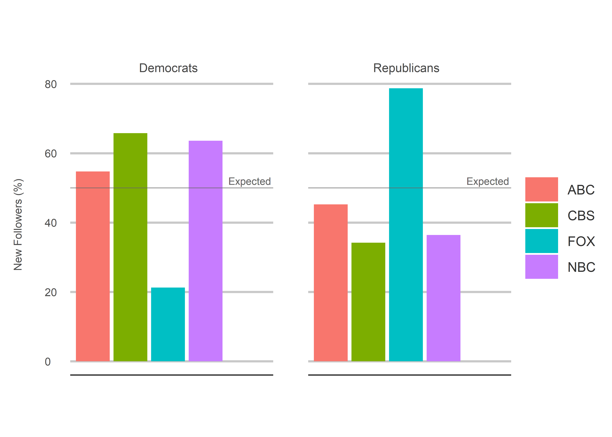
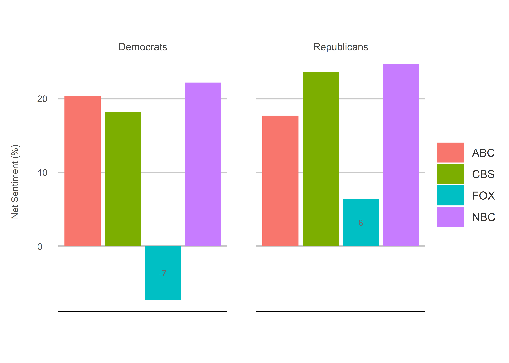
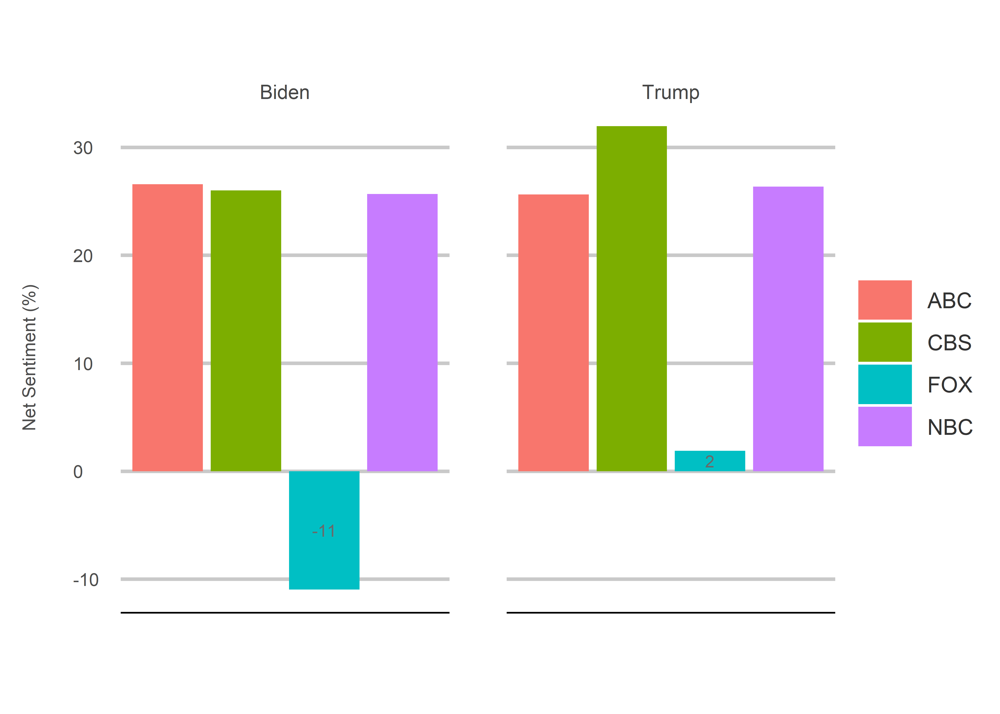

Anchorman
================
Jack Carter
5/21/2022

## **Summary**

The mainstream media in the US is often said to have a liberal bias.
This project investigates whether the 150,000 most recent twitter
followers (as of May 19 2022) of the four largest US broadcasters (ABC,
CBS, FOX and NBC) are more likely to be new followers of the Democrats
or Republicans. It also checks whether these networks are more likely to
tweet positively or negatively about the two political parties and
popular politicians. As for Will Ferrell’s character in Anchorman, there
is a noticeable bias, but mainly among FOX and the Republicans.

 

## Followers

New followers of ABC, CBS and NBC are more likely to be new followers of
the Democrats, while new followers of FOX are significantly more likely
to be new followers of the Republicans. Note, the percentages below are
calculated by network and include only those who are also a new folower
of either party.

<!-- -->

 

 

## Sentiment Analysis

The more liberal networks appear to use similar language when speaking
about the parties and popular politicians, while the mainly Republican
FOX appears to be significantly more negative about the left. Note, net
sentiment is calculated by taking positive from negative words and
dividing the result by the network total.

<!-- -->

<!-- -->

 

## **Disclaimer**

The followers data at the beginning show only the latest 150,000
followers as of May 19 2022, since downloading all of them would take
over 206 hours. What makes this problematic is that these followers are
ordered as the most recent, not a random sample. We can therefore only
make generalizations about the networks’ new followers, not the overall
distribution. Additionally, sentiment analysis does not take context
into account, meaning a liberal bias could be still present, just less
obvious.

 

## **Method**

### **1) Choose Target Accounts:**

The target accounts were chosen because the Democrats and Republicans
are the US’s two main political parties and ABC, CBS, FOX and NBC the
four main broadcasters.

—EXAMPLE CODE SNIPET—

``` r
# creates variables for the US political parties. 
reps <- "@GOP"
dems <- "@TheDemocrats"

# creates variables for the major US broadcasters. 
fox <- "@FoxNews"
nbc <- "@NBCNews"
cbs <- "@CBSNews"
abc <- "@ABC"

# creates an object containing both of the parties.
parties <- c(reps, dems)

# creates an object containing all of the networks. 
networks <- c(fox, nbc, cbs, abc)
```

### **2) Get Followers:**

Several functions are written with the help of the rtweet package to get
the followers of multiple accounts and combine them into a tidy table.

—EXAMPLE CODE SNIPET—

``` r
# retrieves the target account's followers.
get_followers <- function(target_account) {
  followers <- rtweet::get_followers(
    user = target_account,
    n = num,
    retryonratelimit = TRUE
  )
  return(followers)
}

# retrieves multiple target account followers. 
get_multiple_followers <- function(target_accounts) {
  followers <- list()
  for(i in 1:length(target_accounts)) {
    followers[[i]] <- get_followers(target_accounts[i]) %>%
      mutate(network = str_replace_all(target_accounts[i], c("@" = "", "News" = "")))
  }
  tidy_df <- rbind_pages(followers) %>% as_tibble()
  return(tidy_df)
}
```

 

### **3) Calculate Download Time:**

The download time for each follower of every account was calculated as
over 206 hours with twitter’s rate limit restrictions. The less
ambitious task of analyzing the most recent 150,000 for each account was
instead opted for, taking only 3 hours in download time.

—EXAMPLE CODE SNIPET—

``` r
# calculates how many hours it would take to download all 
# followers with rate limits (206+). 
(((2.2+2.9+21.7+17.4+8.6+9.1)*10^6)/75000)/4
```

    ## [1] 206.3333

``` r
# calculates how many hours it would take to download the
# latest 100,000 followers with rate limits (3). 
(((150*6)*10^3)/75000)/4
```

    ## [1] 3

 

### **4) Calculate Network Ratio:**

The network ratios are also calculated as the percentage of followers
for each party divided by the total number appearing in one of the two
parties, but grouped by network.

—EXAMPLE CODE SNIPET—

``` r
# creates an object containing the networks. 
networks <- c("ABC", "CBS", "NBC", "FOX")

# gets the ratio of media followers in the followers of a certain party. 
get_ratio <- function(data, media, party) {
  ratio <- sum(data[data$network==media,]$user_id %in% data[data$network==party,]$user_id)
  return(ratio)
}

# calculates the total and party ratios of democrats 
# to republicans for each network. 
get_ratios <- function(data, media) {
  ratios <- list()
  for(i in 1:length(networks)) {
    dems <- get_ratio(data, media[i], "Democrats")
    reps <- get_ratio(data, media[i], "Republicans")
    dem_party_ratio <- dems/(dems+reps)
    rep_party_ratio <- reps/(dems+reps)
    ratios[[i]] <- list(dem_party_ratio,
                        rep_party_ratio)
  }
  networks_list <- list()
  for(i in 1:length(media)) {
    networks_list[[i]] <- rep(media[i], 2)
  }
  final_df <- tibble(value = unlist(ratios),
                     ratio = rep(c("dem_party_ratio", 
                                   "rep_party_ratio"),4),
                     media = unlist(networks_list))
  return(final_df)
}
# gets the democratic follower ratio for the 4 major networks. 
network_ratios <- get_ratios(followers_data, networks)
```

 

### **5) Get Timelines:**

Several functions are written with the help of the rtweet package to get
the timelines of multiple accounts and combine them into a tidy table.

—EXAMPLE CODE SNIPET—

``` r
# retrieves the target account's timeline. 
get_timeline <- function(target_account) {
  timeline <- rtweet::get_timeline(
    user = target_account,
    n = 3200
  )
  return(timeline)
}

# retrieves multiple target account timelines.  
get_multiple_timelines <- function(target_accounts) {
  timelines <- list()
  for(i in 1:length(target_accounts)) {
    timelines[[i]] <- get_timeline(target_accounts[i])[,"text"] %>%
      mutate(network = str_replace_all(target_accounts[i], c("@" = "", "News" = "")))
  }
  tidy_df <- rbind_pages(timelines) %>% as_tibble()
  return(tidy_df)
}
```

 

### **6) Filter Timelines:**

The timelines text data are filtered to only include those mentioning
the two political parties and popular politicians. Democrat and
progressives are combined onto a Democrats index, while Republican and
GOP are combined onto a Republicans index.

—EXAMPLE CODE SNIPET—

``` r
# lists the topics to explore. 
topics <- c("Democrat",
            "progressives",
            "Republican",
            "GOP",
            "Biden",
            "Trump")

# returns a data frame of text for all topics and networks. 
get_topics_data <- function(data, topics) {
  text <- list()
  for(i in 1:length(topics)) {
    text[[i]] <- data[str_detect(data$text, topics[i]),] %>%
      mutate(topic = topics[i])
  }
  final_df <- rbind_pages(text) %>% as_tibble()
  return(final_df)
}

# stores the data frame of text, topics and networks. 
topics_data <- get_topics_data(timelines_data, topics) %>%
  mutate(topic = str_replace_all(topic, c("Democrat" = "Democrats",
                                          "progressives" = "Democrats",
                                          "Republican" = "Republicans",
                                          "GOP" = "Republicans")))
```

 

### **7) Calculate Sentiment:**

Net sentiment is calculated by getting the sentiment values from the NRC
sentiment library and dividing the positive minus negative words of each
network and topic by the total of each network.

—EXAMPLE CODE SNIPET—

``` r
# gets the sentiment for the text column of given data frames. 
get_sentiment <- function(data) {
  sentiment <- get_sentiments("nrc") %>% 
    select(word, sentiment)
  words <- data %>%
    unnest_tokens(word, text) %>%
    left_join(sentiment, by = "word") %>%
    mutate(sentiment = replace_na(sentiment, replace = "none")) %>%
    filter(!word %in% stop_words$word) %>%
    group_by(network, topic) %>%
    count(sentiment) %>%
    rename(words = "n")
  return(words)
}

# creates a barplot for the timelines data. 
get_timelines_barplot <- function(data, topics, label=NULL) {
  barplot <- data %>%
    filter(topic %in% topics) %>%
    spread(key = sentiment, value = words, -c(1,2)) %>%
    group_by(network) %>%
    mutate(total = (positive+negative)) %>%
    group_by(network, topic) %>%
    mutate(Net = ((positive-negative)/total)*100) %>%
    ggplot(aes(x=network,y=Net,fill=network)) +
    geom_bar(stat = "identity", position = "dodge") +
    geom_text(aes(label=ifelse(network=="FOX",round(Net),"")),
              size=3 ,
              col="#696969",
              position = position_stack(vjust = 0.5)) +
    ggtitle(label) +
    xlab("") +
    ylab("Net Sentiment (%)") +
    facet_wrap(~topic) +
    my_theme +
    theme(axis.text.x = element_blank(),
          axis.ticks.x = element_blank())
  return(barplot)
}
```

 

## **Sources**

  - Hassell et.al. (2020)
    <https://www.science.org/doi/10.1126/sciadv.aay9344>

  - Rwteet (2022) <https://github.com/ropensci/rtweet>

  - Twitter (2022) <https://twitter.com/home>
